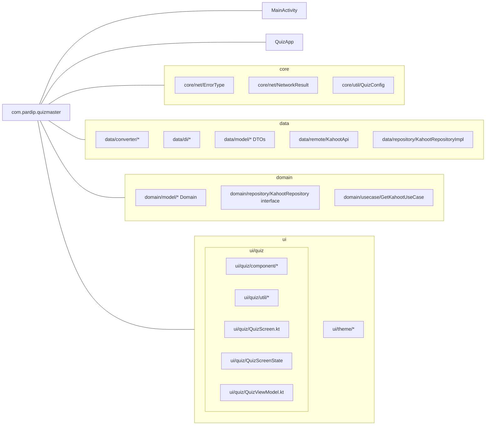

# QuizMaster
A small quiz app that fetch question information from API, maps it to domain models, and renders a timed quiz in Jetpack Compose. The project uses Hilt for DI, Retrofit/OkHttp for networking, and Kotlinx Serialization for JSON

# Tech stack
* Kotlin 2.2.x (JDK 17 toolchain)
* Jetpack Compose + Material 3
* Hilt (with KSP compiler)
* Retrofit + OkHttp (+ logging)
* kotlinx.serialization
* Coil for images
* Coroutines / Flow
* Unit testing: JUnit4, MockWebServer, MockK, standard assert

# Folder structure 

# Setup
* Android Studio Narwhal Feature Drop | 2025.1.2
* JDK 17 
* minSdk 28, compile/target 36

# Testing (what's covered)
* Repository, UseCase, DomainMapping, View Model test cases

# Known limitations
* Landscape not supported: portrait-only composition doesn’t adapt yet.
* No UI tests (Compose/espresso).
* No offline/cache (every run hits network).
* Accessibility (TalkBack, semantics) needs a pass.
* No localization (strings are English only).

# Improvements (and how to address)
* Responsive layout:
  * Introduce size classes and WindowInsets handling.
  * Two-pane (image|content) in landscape with weighted Row and min widths.
* UI tests : Add Compose UI tests for flows (progress → continue, banners, etc.).
* Error UX :  Map ErrorType → user-friendly messages + retry/backoff.
* Design system : Centralize tokens (spacing/typography/shape), extract components.
* Caching / offline : OkHttp cache + ETag/If-Modified-Since; optionally Room for persistence.
* Modularization (Planned) : I haven’t worked on a multi-module setup before, but I plan to split the project into `:domain`, `:data`, and `:app` for stricter boundaries and faster builds.
  
    ***Target layout***
    - `:domain` — pure Kotlin (no Android). Business models, repository **interfaces**, and use cases.
    - `:data` — Android library. DTOs, Retrofit/OkHttp, Room, and repository **implementations**. Provides bindings to `:domain` via Hilt.
    - `:app` — Android application. Compose UI + ViewModels. Depends on `:domain` and `:data`.

